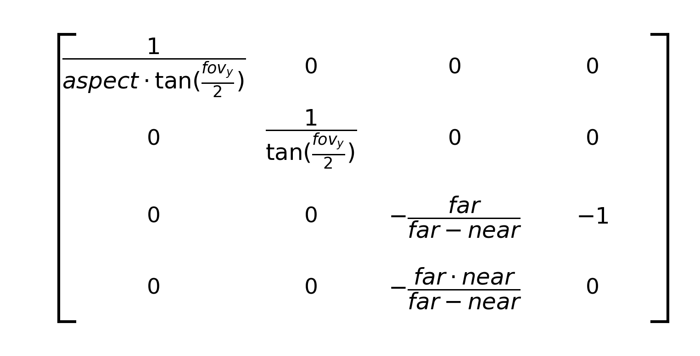
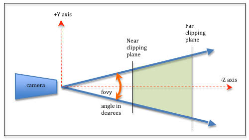
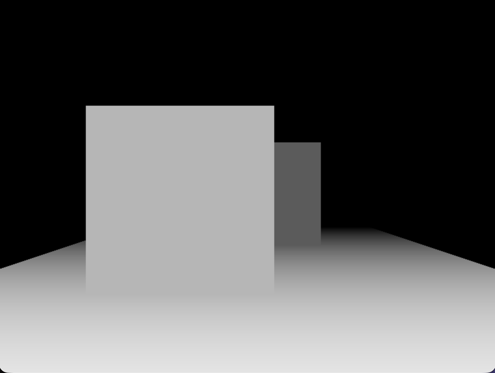
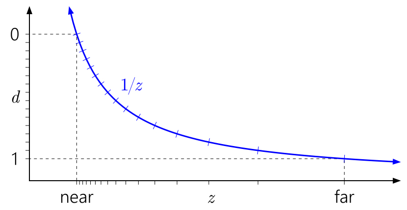
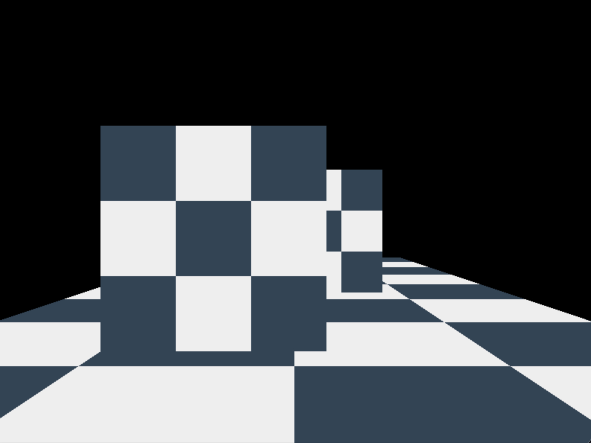

# Building a Software Renderer from Scratch

A CPU renderer in C++ and SDL3.


Repo: github.com/HudsonBean/renderer · Written by Hudson D. Bean

---

## Overview

This renderer can accurately display a 3D model to a screen using Blinn-Phong lighting, perspective projection, and textures in real-time. I chose a metallic bust to display the rendering capabilities as it has unique geometry as well as an interesting metallic texture to display lighting. I learned the fundamentals behind graphics programming as well as the complex mathematics behind them. This includes how to draw lines efficiently with Bresenham's line drawing algorithm, decide if a pixel is inside a triangle using barycentric coordinates, how to accurately project 3D points to a 2D screen using perspective projection math, implementing a depth buffer for occlusion, how to in take normal data and apply the Blinn-Phong lighting model to that information, and lastly how to utilize a texture image and U, V texture coordinates to map a texture onto a surface.

**Stack:** C++17, SDL3 (windowing + framebuffer), SDL3_image for handling PNG texture. No external math or
graphics libraries.

---

## Rasterization: Edge Functions & Barycentrics

**The problem.** Rasterization is the process of deciding where to place pixels on the screen. These potential pixel locations are known as fragments. A natural naive attempt may be scanline fill, sort the vertices, walk the edges, and draw shorter horizontal spans toward the tip. Great for flat color, but it has some draw backs when wanting to implement lighting, textures, etc.

**The insight.** What actually is needed is three weights per pixel. How much of each vertex $A$, $B$, and $C$ makes up this pixel coordinate. This is known as barycentric coordinates. For each edge you compute an edge function at the pixel's center, which is just the 2D cross product of the edge vector and the vector to the pixel.
```cpp
orient2D(A, B, P) = (B.x - A.x) * (P.y - A.y) - (B.y - A.y) * (P.x - A.x)
```
The sign of that cross product tells which side of the edge the pixel is on. Perform the function on all three edges, and if the pixel sits on the same side of every one it's inside. But the magnitude of each edge function is twice the area of the sub-triangle formed by that edge and the pixel, the piece opposite one vertex, so dividing it by the full triangle's area gives that vertex's weight directly. The three weights sum to 1. The elegant part is that one computation does both jobs at once. The signs of the three edge functions decide coverage, and their normalized magnitudes are the interpolation weights every later stage depends on.

**Something that tricked me up.** The naive inside test, "all three edge functions are positive," assumes every triangle is wound counter-clockwise on screen. It isn't. Depending on vertex order and the $y$-flip into screen space, plenty of triangles come out clockwise, and for those all three edge functions are negative, so a positive-only test rejects every pixel and the triangle silently vanishes. The fix is to divide the edge functions by the triangle's signed area rather than its absolute area. The signed area carries the winding direction, so the division flips the signs to match. A pixel that is inside yields positive weights whether the triangle is wound clockwise or counter-clockwise, and a single weights $\geq 0$ test covers both.


---

## Perspective Projection

**The problem.** The model lives in 3D, but the screen is a flat grid of pixels. We need a way to collapse the $Z$ axis into the $X$, and $Y$ as a 2D screen position. The trick is perspective where things farther away appear smaller. That shrinking with distance is the whole idea and it's simply a division. An object twice as far away should come out half the size so intuitvely $\frac{x}{distance}$. The tricky part is that the transform pipeline is built on matrix multiplication, and a matrix multiply can't divide, every output is a sum of scaled inputs, never a quotient. So the core problem is perspective needs division, but the tool is a matrix that can only add and scale.

**The insight.** With only matrix multiplication, which can only scale and sum its inputs, the solution is to have the matrix stage the division and a seperate per-vertex step perform the division. Every point carries a fourth homogeneous coordinate $w$, and after the multiply the renderer divides $x$, $y$, and $z$ each by $w$. The matrix therefore never computes perspective directly. It writes the correct divisor into $w$ so that the subsequent divide produces it.

Four quantities populate the matrix. The perspective term is a single $-1$ positioned so that the multiply copies $-z$ into the output $w$, yielding a clip-space point $(x', y', z', -z)$; the following division by $w$ then turns $x'$ into $\frac{x'}{(-z)}$, and the division is achieved. This term is where handedness enters. I use a right-handed system, similiar to that of OpenGL: the camera looks down $-z$, so geometry in front of it has negative $z$, and $-z$ is therefore its positive distance. Copying $-z$ into $w$ gives visible points a positive $w$, which is what the divide requires. (A left-handed convention looks down $+z$ and places $+1$ here instead.) The choice is a convention, not a matter of validity.

The two scale terms come from the field of view. The vertical scale $f = \frac{1}{\tan(\mathrm{fov}_y / 2)}$ occupies the $[1][1]$ cell and follows directly from the frustum's half-angle. A larger FOV value esentially "crams" more world into the screen. The horizontal scale is that same $f$ divided by the aspect ratio, in $[0][0]$. Dividing the horizontal term by the aspect ratio fixes the horizontal field of view through the relation $\tan(\mathrm{fov}_x / 2) = \mathrm{aspect} \cdot \tan(\mathrm{fov}_y / 2)$, so that a wider viewport widens the frustum horizontally to match rather than stretching the image.

The two depth coefficients $A$ and $B$ remap view-space depth onto a fixed range. I map the near plane to $0$ and the far plane to $1$, the $[0, 1]$ convention used by modern APIs such as Direct3D and Vulkan (the alternative $[-1, 1]$ convention differs only in these two entries). Those two boundary conditions, $\mathrm{near} \to 0$ and $\mathrm{far} \to 1$, are exactly enough to determine the two unknowns, giving $A = \frac{-\mathrm{far}}{\mathrm{far} - \mathrm{near}}$ in $[2][2]$ and $B = \frac{-(\mathrm{far} \cdot \mathrm{near})}{\mathrm{far} - \mathrm{near}}$ in $[3][2]$.



**An error I made.** The first time I ran the code after adding perspective projection, the screen rendered completely black. The cause was I had initialized my perspective matrix as `Mat4 m{}`, which in C++ zero-initializes every entry, including the term meant to copy $-z$ into $w$. A fully-zero matrix sends every vertex to $(0,0,0,0)$. With $w = 0$, the perspective divide was dividing by zero, and my near-plane guard flagged every triangle as degenerate and skipped it. The fix was to make a $Mat4::perspective$ which goes through and explicitly sets each row and column to what they need to be, giving me an accurate starting matrix.



---

## Depth Buffering

**The problem.** Right now we are drawing triangles into the framebuffer in an arbitrary order. Nothing says the pixel closest to the camera should be drawn before the one that is thousands of units out, whichever triangle happens to be drawn last wins the pixel, so a far wall drawn after a near one paints right over it. One fix is the painter's algorithm where we sort every triangle back-to-front each frame and draw in that order. But sorting per frame is expensive, and it fails on triangles that intersect or overlap cyclically, since no single valid order exists for them. What we actually want is to decide occlusion per pixel, so that draw order stops mattering entirely.

**The insight.** The solution is essentially a second framebuffer. Where the framebuffer stores a color per pixel, this buffer stores a depth per pixel. This buffer is known as a depth buffer or z buffer and we define it as `std::vector<float> depth_buffer(WIDTH * HEIGHT);`, it allows one float per pixel. (A vector is convenient here because it gives us `.data()`, `.begin()`, `.end()`, and `std::fill(...)`, a raw array would work equally well.) Each frame we clear it to $+\infty$, since nothing has been seen yet and anything is closer than infinity. Then, for each fragment, I interpolate its depth from the triangle's three vertices, compare it against the value already stored at that pixel, and if the fragment is nearer it wins writing its color to the framebuffer and overwriting the stored depth. If it is farther, it is discarded and neither buffer is touched.
The non-obvious detail is in the interpolation itself: `const float depth = alpha * a.z + beta * b.z + gamma * c.z;`. There is no division by $w$ here. Depth is the only attribute interpolated with plain barycentric weights, every other attribute (texture coordinates, normals) requires perspective correction, yet depth does not. The reason is that the $z$ being interpolated has already passed through the perspective divide during projection, and that divide is precisely what made $z$ linear in screen space. Because it is already linear, a straight barycentric blend produces the correct value; applying perspective correction to it wouldn't be correct.



**A caveat.** After projection, depth is not distributed linearly through the view volume, it follows a $\frac{1}{z}$ curve, a direct result of the perspective divide. The practical consequence is that depth precision is dense near the camera and sparse far away. Two distant surfaces separated by a real gap can map to depth values so close that they round to the same float. The result is z-fighting, the surfaces flicker against each other frame to frame as the depth test arbitrarily favors one, then the other. The failure is not in the buffer or the test, it is that the available precision was spent almost entirely on near geometry, leaving too little to separate far geometry. The mitigation is to push the near plane, zNear, as far out as the scene tolerates, since the tightest part of the $\frac{1}{z}$ curve sits just beyond it, widening that distance redistributes precision outward and reclaims the resolution that resolves distant surfaces.



---

## Perspective-Correct Interpolation

**The problem.** Once a fragment is placed inside a triangle, its attributes: texture coordinates, normals, colors, all have to placed using the vertices' 3 barycentric weights. The first approach I had was the linearly interpolate them across the screen like the depth buffer; however, this produces visibly wrong results. The cause is the same $\frac{1}{z}$ nonlinearity from projection. Perspective compresses distant geometry unevenly in screen space, so that equal steps across a screen do not correspond to equal steps across the surface. A vertex that is farther away contribute less per screen-pixel than a near one, but plain screen-space interpolation gives all three vertices equal say, ignoring that they sit at different depths.

**The insight.** The fix is to interpolate each attribute in a space where it is linear, then convert back. An attribute is not linear across the screen, but the attribute divided by it's vertex's $w$ is; and so is $\frac{1}{w}$ itself. For each attribute I interpolate two quantities with plain barycentric weights, $\frac{attribute}{w}$ at each vertex, and $\frac{1}{w}$ at each vertex. Diving the first interpolated result by the second cancels out the $w$ term so we just have the true perspective-correct attribute for that fragment.
```cpp
const float inv_w = alpha * a.inv_w + beta * b.inv_w + gamma * c.inv_w;

const float u = (alpha * a.u * a.inv_w + beta * b.u * b.inv_w +
                 gamma * c.u * c.inv_w) / inv_w; // true perspective-correct attribute
```
The numerator interpolates $\frac{u}{w}$ while the denominator interpolates $\frac{1}{w}$, together the divison returns $u$. This is the reason $w$ is carried past the perspective divide and stored per screen-vertex as $inv_w$. After the division by $w$ that produces screen cordinates, $w$ has served its role in perjection and could be discarded; however, it is the quantity needed to undo perspective during interpolation.



---