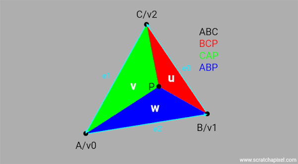

# Building a Software Renderer from Scratch

A CPU renderer in C++ and SDL3. Every pixel, matrix, and lighting calculation from scratch to understand the graphics pipeline from the ground up.

Repo: github.com/HudsonBean/renderer · Written by Hudson D. Bean

---

## Overview

This renderer can accurately display a 3D model to a screen using Blinn-Phong lighting, perspective projection, and textures in real-time. I chose a metallic bust to display the rendering capabilities as it has interesting geometry as well as an interesting metallic texture to display lighting. I learned the fundamentals behind graphics programming as well as the interesting math behind those. This includes how to draw lines efficiently with Bresenham's line drawing algorithm, decide if a pixel is inside a triangle using barycentric coordinates, how to accurately project 3D points to a 2D screen using perspective projection math, implementing a depth buffer for occlusion, how to in take normal data and apply the Blinn-Phong lighting model to that information, and lastly how to utilize a texture image and U, V texture coordinates to map a texture onto a surface.

**Pipeline:** model → world → view → clip → NDC → screen, with a depth buffer
for occlusion and per-pixel Blinn-Phong lighting.

**Stack:** C++17, SDL3 (windowing + framebuffer), SDL3_image for handling PNG texture. No external math or
graphics libraries.

---

<!--
============================================================
PER-FEATURE TEMPLATE — repeat this block for each of your 4–5
chosen features. Keep each feature to THREE beats. Resist adding
more; density beats volume when a reviewer skims for 5 minutes.

The three beats, every time:
  1. THE PROBLEM   — what this stage solves, and why the naive approach fails.
  2. THE INSIGHT   — ONE derived or non-obvious thing. This is the uncopyable
                     part: derive a formula, explain a subtlety, justify a
                     tradeoff. A pasted result proves nothing; a derivation
                     proves you understand it.
  3. THE BUG       — ONE real thing that broke: the symptom, your wrong first
                     theory, the fix. This is what separates "read a tutorial"
                     from "built it." Reviewers read this hardest.

Optional per feature: one code snippet (short!) OR one image. Not both,
usually. A failure image (something rendering WRONG) is worth more than
another correct one — it proves you understand why correct is correct.
============================================================
-->

## [Rasterization: Edge Functions & Barycentrics]

**The problem.** Rasterization is the process of deciding where to place pixels on the screen. These potential pixel locations are known as fragments. A natural naive attempt may be scanline fill, sort the vertices, walk the edges, and draw shorter horizontal spans toward the tip. That works for flat color, but it has some draw backs when wanting to implement lighting, textures, etc.

**The insight.** What actually is needed is three weights per pixel. How much of each vertex A, B, and C makes up this pixel coordinate. This is known as barycentric coordinates. For each edge you compute an edge function at the pixel's center, which is just the 2D cross product of the edge vector and the vector to the pixel. $orient2D(A,B,P) = (B.x - A.x)\times (P.y - A.y) - (B.y - A.y)\times (P.x - A.x)$ The sign of that cross product tells which side of the edge the pixel is on. Perform the function on all three edges, and if the pixel sits on the same side of every one, it's inside. But the magnitude of each edge function is twice the area of the sub-triangle formed by that edge and the pixel, the piece opposite one vertex, so dividing it by the full triangle's area gives that vertex's weight directly. The three weights sum to 1. The elegant part is that one computation does both jobs at once. The signs of the three edge functions decide coverage, and their normalized magnitudes are the interpolation weights every later stage depends on.

**The catch.** The naive inside test, "all three edge functions are positive," assumes every triangle is wound counter-clockwise on screen. It isn't. Depending on vertex order and the y-flip into screen space, plenty of triangles come out clockwise, and for those all three edge functions are negative — so a positive-only test rejects every pixel and the triangle silently vanishes. The fix is to divide the edge functions by the triangle's signed area rather than its absolute area. The signed area carries the winding direction, so the division flips the signs to match. A pixel that is inside yields positive weights whether the triangle is wound clockwise or counter-clockwise, and a single weights >= 0 test covers both.

---