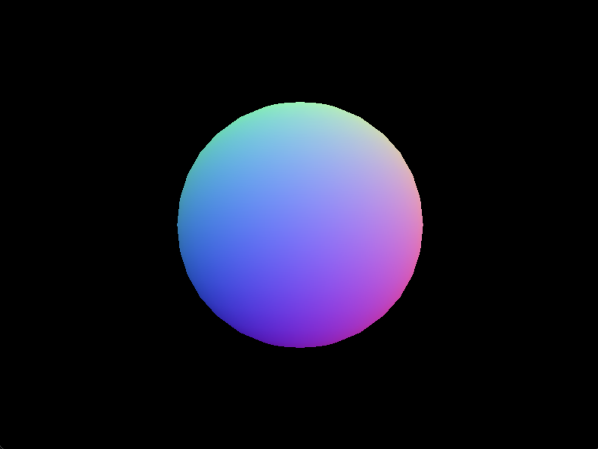
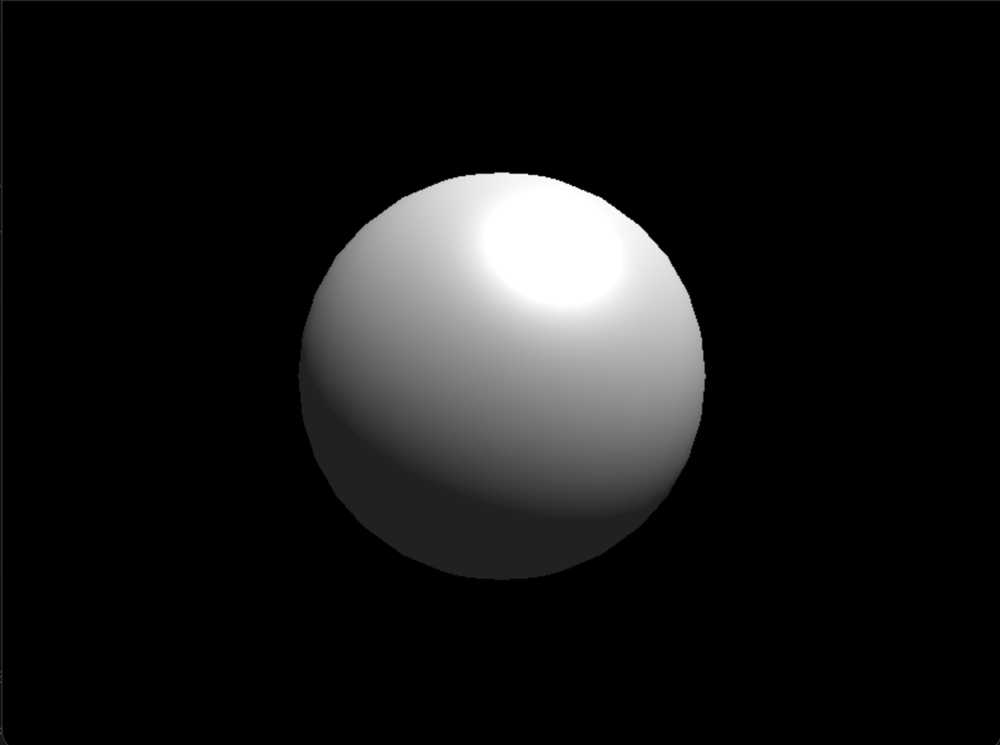

# Building a Software Renderer from Scratch

A CPU renderer in C++ and SDL3.

<p align="center">
  
</p>

Repo: github.com/HudsonBean/renderer · Written by Hudson D. Bean

---

## Overview

This renderer can accurately display a 3D model on a screen using Blinn-Phong lighting, perspective projection, and textures in real time. I chose a metallic bust of Jesus Christ to display the rendering capabilities, as it has unique geometry as well as an interesting metallic texture to display lighting. The renderer rasterizes triangles via barycentric coverage, projects with a hand-built perspective matrix, resolves occlusion with a depth buffer, shades per-pixel with Blinn-Phong, and maps textures through perspective-correct UVs.

**Stack:** C++20, SDL3 (windowing + framebuffer), SDL3_image for handling PNG texture. No external math or
graphics libraries.

---

## Rasterization: Edge Functions & Barycentrics

**The problem.** Rasterization is the process of deciding where to place pixels on the screen. These potential pixel locations are known as fragments. A natural naive attempt may be scanline fill, sort the vertices, walk the edges, and draw shorter horizontal spans toward the tip. Great for flat color, but it has some drawbacks when wanting to implement lighting, textures, etc.

**The insight.** What actually is needed is three weights per pixel. How much of each vertex $A$, $B$, and $C$ makes up this pixel coordinate. This is known as barycentric coordinates. For each edge, you compute an edge function at the pixel’s center, which is just the 2D cross product of the edge vector and the vector to the pixel.

```cpp
orient2D(A, B, P) = (B.x - A.x) * (P.y - A.y) - (B.y - A.y) * (P.x - A.x)
```

The sign of that cross product tells which side of the edge the pixel is on. Perform the function on all three edges, and if the pixel lies on the same side of each, it’s inside. But the magnitude of each edge function is twice the area of the sub-triangle formed by that edge and the pixel, the piece opposite one vertex, so dividing it by the full triangle’s area gives that vertex’s weight directly. The three weights sum to 1. The elegant part is that one computation does both jobs at once. The signs of the three edge functions decide coverage, and their normalized magnitudes are the interpolation weights every later stage depends on.

**Something that tricked me.** The naive inside test, “all three edge functions are positive,” assumes every triangle is wound counter-clockwise on screen. It isn’t. Depending on vertex order and the $y$-flip into screen space, plenty of triangles come out clockwise, and for those all three edge functions are negative, so a positive-only test rejects every pixel and the triangle silently vanishes. The fix is to divide the edge functions by the triangle’s signed area rather than its absolute area. The signed area carries the winding direction, so the division flips the signs to match. A pixel that is inside yields positive weights whether the triangle is wound clockwise or counter-clockwise, and a single weights $\geq 0$ test covers both.

<p align="center"></p>

---

## Perspective Projection

**The problem.** The model lives in 3D, but the screen is a flat grid of pixels. We need a way to collapse the $Z$ axis into the $X$ and $Y$ as a 2D screen position. The trick is perspective, where things farther away appear smaller. That shrinking with distance is the whole idea, and it’s simply a division. An object twice as far away should come out half the size, so intuitively $\frac{x}{distance}$. The tricky part is that the transform pipeline is built on matrix multiplication, and a matrix multiply can’t divide; every output is a sum of scaled inputs, never a quotient. So the core problem is perspective needs division, but the tool is a matrix that can only add and scale.

**The insight.** With only matrix multiplication, which can only scale and sum its inputs, the solution is to have the matrix stage the division and a separate per-vertex step perform the division. Every point carries a fourth homogeneous coordinate $w$, and after the multiply, the renderer divides $x$, $y$, and $z$ each by $w$. The matrix therefore never computes perspective directly. It writes the correct divisor into $w$ so that the subsequent divide produces it.

Four quantities populate the matrix. The perspective term is a single $-1$ positioned so that the multiply copies $-z$ into the output $w$, yielding a clip-space point $(x’, y’, z’, -z)$; the following division by $w$ then turns $x’$ into $\frac{x’}{(-z)}$, and the division is achieved. This term is where handedness enters. I use a right-handed system, similar to that of OpenGL: the camera looks down $-z$, so geometry in front of it has negative $z$, and $-z$ is therefore its positive distance. Copying $-z$ into $w$ gives visible points a positive $w$, which is what the divide requires. (A left-handed convention looks down $+z$ and places $+1$ here instead.) The choice is a convention, not a matter of validity.

The two scale terms come from the field of view. The vertical scale $f = \frac{1}{\tan(\mathrm{fov}_y / 2)}$ occupies the $[1][1]$ cell and follows directly from the frustum’s half-angle. A larger FOV value essentially “crams” more world into the screen. The horizontal scale is that same $f$ divided by the aspect ratio, in $[0][0]$. Dividing the horizontal term by the aspect ratio fixes the horizontal field of view through the relation $\tan(\mathrm{fov}_x / 2) = \mathrm{aspect} \cdot \tan(\mathrm{fov}_y / 2)$, so that a wider viewport widens the frustum horizontally to match rather than stretching the image.

The two depth coefficients $A$ and $B$ remap view-space depth onto a fixed range. I map the near plane to $0$ and the far plane to $1$, the $[0, 1]$ convention used by modern APIs such as Direct3D and Vulkan (the alternative $[-1, 1]$ convention differs only in these two entries). Those two boundary conditions, $\mathrm{near} \to 0$ and $\mathrm{far} \to 1$, are exactly enough to determine the two unknowns, giving $A = \frac{-\mathrm{far}}{\mathrm{far} - \mathrm{near}}$ in $[2][2]$ and $B = \frac{-(\mathrm{far} \cdot \mathrm{near})}{\mathrm{far} - \mathrm{near}}$ in $[3][2]$.

<p align="center"></p>

**An error I made.** The first time I ran the code after adding perspective projection, the screen rendered completely black. The cause was that I had initialized my perspective matrix as `Mat4 m{}`, which in C++ zero-initializes every entry, including the term meant to copy $-z$ into $w$. A fully-zero matrix sends every vertex to $(0,0,0,0)$. With $w = 0$, the perspective divide was dividing by zero, and my near-plane guard flagged every triangle as degenerate and skipped it. The fix was to make a `Mat4::perspective` which goes through and explicitly sets each row and column to what they need to be, giving me an accurate starting matrix.

<p align="center"></p>

---

## Depth Buffering

**The problem.** Right now we are drawing triangles into the framebuffer in an arbitrary order. Nothing says the pixel closest to the camera should be drawn before the one that is thousands of units out; whichever triangle happens to be drawn last wins the pixel, so a far wall drawn after a near one paints right over it. One fix is the painter’s algorithm, where we sort every triangle back-to-front each frame and draw in that order. But sorting per frame is expensive, and it fails on triangles that intersect or overlap cyclically, since no single valid order exists for them. What we actually want is to decide occlusion per pixel, so that draw order stops mattering entirely.

**The insight.** The solution is essentially a second framebuffer. Where the framebuffer stores a color per pixel, this buffer stores a depth per pixel. This buffer is known as a depth buffer or z buffer and we define it as `std::vector<float> depth_buffer(WIDTH * HEIGHT);`, it allows one float per pixel. (A vector is convenient here because it gives us `.data()`, `.begin()`, `.end()`, and `std::fill(...)`; a raw array would work equally well.) Each frame we clear it to $+\infty$, since nothing has been seen yet and anything is closer than infinity. Then, for each fragment, I interpolate its depth from the triangle’s three vertices, compare it against the value already stored at that pixel, and if the fragment is nearer, it wins, writing its color to the framebuffer and overwriting the stored depth. If it is farther, it is discarded, and neither buffer is touched.
The non-obvious detail is in the interpolation itself: `const float depth = alpha * a.z + beta * b.z + gamma * c.z;`. There is no division by $w$ here. Depth is the only attribute interpolated with plain barycentric weights; every other attribute (texture coordinates, normals) requires perspective correction, yet depth does not. The reason is that the $z$ being interpolated has already passed through the perspective divide during projection, and that divide is precisely what made $z$ linear in screen space. Because it is already linear, a straight barycentric blend produces the correct value; applying perspective correction to it wouldn’t be correct.

<p align="center"></p>

**A caveat.** After projection, depth is not distributed linearly through the view volume; it follows a $\frac{1}{z}$ curve, a direct result of the perspective divide. The practical consequence is that depth precision is dense near the camera and sparse far away. Two distant surfaces separated by a real gap can map to depth values so close that they round to the same float. The result is z-fighting; the surfaces flicker against each other frame to frame as the depth test arbitrarily favors one, then the other. The failure is not in the buffer or the test; it is that the available precision was spent almost entirely on near geometry, leaving too little to separate far geometry. The mitigation is to push the near plane, `zNear`, as far out as the scene tolerates, since the tightest part of the $\frac{1}{z}$ curve sits just beyond it; widening that distance redistributes precision outward and reclaims the resolution that resolves distant surfaces.

<p align="center"></p>

---

## Perspective-Correct Interpolation

**The problem.** Once a fragment is placed inside a triangle, its attributes: texture coordinates, normals, colors, all have to be placed using the vertices’ 3 barycentric weights. The first approach I had was to linearly interpolate them across the screen like the depth buffer; however, this produces visibly wrong results. The cause is the same $\frac{1}{z}$ nonlinearity from projection. Perspective compresses distant geometry unevenly in screen space, so that equal steps across a screen do not correspond to equal steps across the surface. A vertex that is farther away contributes less per screen-pixel than a near one, but plain screen-space interpolation gives all three vertices equal say, ignoring that they sit at different depths.

**The insight.** The fix is to interpolate each attribute in a space where it is linear, then convert back. An attribute is not linear across the screen, but the attribute divided by its vertex’s $w$ is; and so is $\frac{1}{w}$ itself. For each attribute, I interpolate two quantities with plain barycentric weights, $\frac{attribute}{w}$ at each vertex, and $\frac{1}{w}$ at each vertex. Dividing the first interpolated result by the second cancels out the $w$ term, so we just have the true perspective-correct attribute for that fragment.

```cpp
const float inv_w = alpha * a.inv_w + beta * b.inv_w + gamma * c.inv_w;

const float u = (alpha * a.u * a.inv_w + beta * b.u * b.inv_w +
                 gamma * c.u * c.inv_w) / inv_w; // true perspective-correct attribute
```

The numerator interpolates $\frac{u}{w}$ while the denominator interpolates $\frac{1}{w}$, together the division returns $u$. This is the reason $w$ is carried past the perspective divide and stored per screen-vertex as `inv_w`. After the division by $w$ that produces coordinates, $w$ has served its role in projection and could be discarded; however, it is the quantity needed to undo perspective during interpolation.

<p align="center"></p>

---

## Texture Mapping

**The problem.** Right now we have single flat colors per surface only. Cool, but not realistic. A real model needs its surface detail, the color variation baked into an image, painted onto it. The model provides UV coordinates, which are a 2D coordinate per vertex naming a location in a texture image, where `(0,0)` is one corner and `(1,1)` is the opposite. The problem is to take those per-vertex coordinates, determine the UV at every fragment, and read the correct pixel from the image so the picture wraps onto the 3D surface as it should.

**The insight.** The per-fragment UV is already solved; it is just the perspective-correct interpolation from the last section. What remains is converting the normalized coordinate into an actual pixel in the image and reading it. Because UVs are normalized `[0,1]` independent of the image’s resolution, the pixel location is just the coordinate scaled by the image dimensions: $u\times width$ and $v\times height$. Two things make it correct in practice. First, coordinates outside `[0,1]` are wrapped back into the range so the texture tiles rather than reading out of bounds. Second, the vertical axis must be flipped.

```cpp
uint32_t sample_texture(const Texture& tex, float u, float v) {
    u = u - std::floor(u);          // wrap into [0,1)
    v = v - std::floor(v);
    v = 1.0f - v;                    // flip, image origin is top-left, UV origin is bottom-left
    int px = std::min(tex.w - 1, (int)(u * tex.w));
    int py = std::min(tex.h - 1, (int)(v * tex.h));
    return tex.pixels[py * tex.w + px];
}
```

The flip is necessary because the two coordinate systems disagree on where the origin sits. Image memory is stored top-row-first, so its origin is the top-left, while the UV convention places `(0,0)` at the bottom left. Left uncorrected, the texture renders inverted vertically. Once the texel is sampled, it becomes the surface color that the future lighting will act on. The ambient and diffuse terms scale it, and the specular highlight adds on top as the light’s own color.

**The bug.** Loading the image showed me how the decoded pixels are laid out in memory. An `SDL_Surface` does not guarantee its rows are packed tightly end-to-end; each row is padded to a memory-alignment boundary, so the true distance from one row to the next, the surface’s pitch, can be larger than $WIDTH\times 4$ bytes. My first copy assumed tight packing and indexed rows by width, which drifted a few bytes further out of alignment with each row, and it sheared the entire image diagonally. The fix was to increase one full `pitch` per row when copying pixels out, then index within the row.

```cpp
for (int y = 0; y < tex.h; y++) {
    uint32_t* row = (uint32_t*)((uint8_t*)conv->pixels + y * conv->pitch);
    for (int x = 0; x < tex.w; x++)
        tex.pixels[y * tex.w + x] = row[x];
}
```

---

## Phong Shading

**The problem.** Now that I have a geometrically correct model that has been projected with textures, I am ready to apply lighting to the scene. Real surfaces are brighter where they face a light source and darker where they turn away, and glossy ones carry a bright highlight where they reflect the light towards the viewer. The problem is to produce that response to light per pixel, using the surface normals the model provides, without a global illumination solution, a local, per-fragment approximation that is cheap to compute yet convincing.

**The insight.** The shading is built from three additive terms, each modelling a different physical contribution. **Ambient** is a small constant applied everywhere, a stand-in for indirect bounced light so that surfaces facing away from the light are dim rather than pure black. **Diffuse** is the matte response. Lambert’s law states that a surface’s brightness is proportional to the cosine of the angle between its normal $N$ and the direction of the light $L$, also known as the dot product $N\cdot L$ for unit vectors, clamped to zero so surfaces facing away receive nothing. **Specular** is the glossy highlight, and I compute it with the Blinn-Phong formulation: A halfway vector $H=normalize(L+V)$ is formed between the light and view directions, and the highlight is $(N\cdot H)^{s}$, where the exponent $s$ (shininess) controls how tightly the highlight focuses, a low exponent gives a broad sheen, a high one a small sharp glint. $H$ represents the surface orientation that would reflect the light directly at the viewer, so $N\cdot H$ measures how close each fragment is to that ideal mirror angle. The three terms sum to the final shade, with the specular added as the light’s own color rather than the surface’s.
The detail that makes this Phong shading specifically is that the lighting is evaluated per fragment, using normals interpolated across the triangle, rather than per vertex with the resulting colors interpolated. This is what allows a highlight to land in the middle of a triangle rather than only at its corners. But interpolating normals introduces a subtlety. The barycentric blend of three unit vectors is generally not unit length. Averaging vectors of length one produces a shorter vector, since they point in slightly different directions. If that shortened normal is used directly, the dot products it feeds are scaled down, and the shading comes out wrong. The normal must therefore be renormalized after interpolation, per pixel:

```cpp
float len = std::sqrt(nx * nx + ny * ny + nz * nz);
nx /= len;
ny /= len;
nz /= len;
```

<p align="center"></p>

<p align="center"></p>

---

## Results

And with all that done, the final product, voilà!

<p align="center"></p>

---

## Limitations & What’s Next

- **Near-plane clipping** is whole-triangle rejection, not true clipping. Any triangle with a vertex at `w ≤ 1e-5` is discarded entirely (the `behind_near` check), rather than being clipped against the near plane and re-triangulated. A triangle straddling the camera plane vanishes instead of being cut down to its visible portion, so geometry pops at the very edge of the view. Proper Sutherland-Hodgman clipping against the frustum would fix this and is the natural next addition.

- **No back-face culling**. Every triangle is rasterized, including those facing away from the camera that are then overdrawn by nearer front-faces. The signed area I already compute (`area` in `fill_triangle_3d`) carries the winding direction, so culling back-faces is nearly free, a single sign check to skip them, and would roughly halve fill work on closed meshes.

- **The camera is fixed at the origin**. The view transform is translation-only; there is no `look_at`, so the camera cannot orbit or be repositioned, and the model is spun in front of a stationary viewer instead. A proper look-at matrix would allow free camera movement and better framing.

---

## Build & Run

**Dependencies:** a C++20 compiler, CMake 3.16+, [SDL3](https://github.com/libsdl-org/SDL), and [SDL3_image](https://github.com/libsdl-org/SDL_image).

```bash
# macOS (Homebrew)
brew install cmake sdl3 sdl3_image

# Ubuntu / Debian (packages vary by distro; install SDL3 + SDL3_image if available)
sudo apt install cmake g++ libsdl3-dev libsdl3-image-dev
```

```bash
git clone https://github.com/HudsonBean/renderer.git
cd renderer
cmake -S . -B build
cmake --build build

# Run from build/ — the app loads ../scene4.obj and ../scene4.png
cd build
./renderer
```

A window opens with the textured, lit model spinning. Close the window to quit.

---
